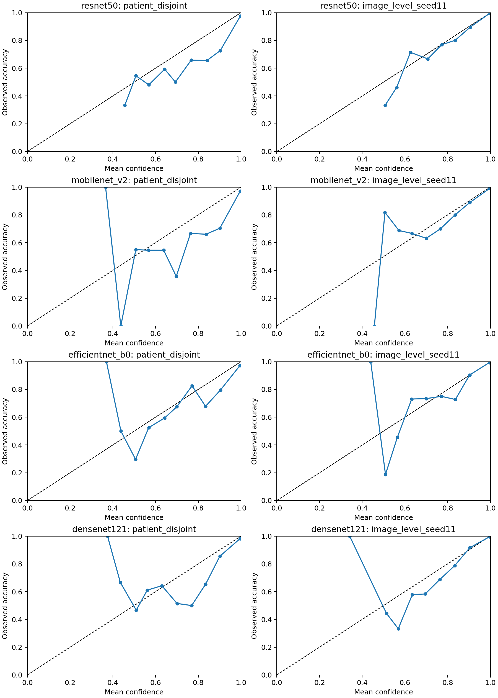
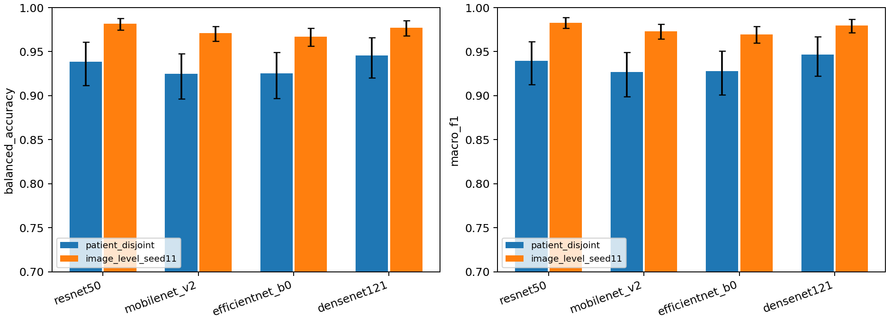

# Multi-model patient-overlap evaluation and ranking reliability

**Status:** 30 of 30 new local Apple MPS runs completed. ResNet50 is reused from PR #1; it was not retrained.

## Design and protocol identity

This analysis uses the original 3,064-image, 233-patient, three-class official Figshare dataset and the frozen PR #1 splits. For prediction filenames and tables, **A means patient-disjoint** (`patient_disjoint_original.csv`) and **B means matched image-level seed 11** (`imagelevel_seed11.csv`). `EXPERIMENT_SPEC_MULTI_MODEL.md` reverses these letters; the split filenames, split hashes, and PR #1 code determine the mapping used here. All protocol differences below are B minus A (image-level minus patient-disjoint).

The new models are MobileNetV2, EfficientNet-B0, and DenseNet121, each trained for five A and five B folds. The unchanged recipe uses per-image min-max normalization, antialiased bilinear resize to 224×224, three-channel replication, ImageNet normalization and pretrained weights, batch size 32, 10 epochs, AdamW (learning rate 1e-4, weight decay 1e-4), per-iteration cosine schedule, unweighted cross-entropy, horizontal flip probability 0.5, rotation ±10°, training seed 0, no early stopping, and final-epoch evaluation. All runs used physical batch size 32; no microbatching, gradient accumulation, mixed precision, or activation checkpointing was used.

The original split SHA-256 values are `61bec5aaf9a5f4fce4adf89b186ffd6479eb0f6095ee20b8f60ef44274a3e49e` (A) and `e8b0442c107396fe66a989b8d448aa0e524c1c554823a711db3cc84beeee74f2` (B). No architecture-specific hyperparameters were tuned.

## Pooled out-of-fold metrics

Every model and protocol has exactly 3,064 unique out-of-fold predictions. Parentheses are class-stratified patient-cluster bootstrap 95% percentile confidence intervals (5,000 draws, seed 2026).

| Model | Protocol | Balanced accuracy | Macro-F1 | Accuracy | ECE (15 bins) | Multiclass Brier |
|---|---|---|---|---|---|---|
| resnet50 | Patient-disjoint | 0.9386 (0.9114–0.9608) | 0.9394 (0.9128–0.9612) | 0.9465 (0.9238–0.9657) | 0.0321 (0.0176–0.0522) | 0.0879 (0.0556–0.1265) |
| resnet50 | Image-level seed 11 | 0.9816 (0.9745–0.9880) | 0.9830 (0.9765–0.9888) | 0.9853 (0.9800–0.9903) | 0.0034 (0.0026–0.0084) | 0.0224 (0.0152–0.0303) |
| mobilenet_v2 | Patient-disjoint | 0.9246 (0.8962–0.9475) | 0.9266 (0.8991–0.9492) | 0.9360 (0.9126–0.9558) | 0.0383 (0.0232–0.0594) | 0.1047 (0.0707–0.1458) |
| mobilenet_v2 | Image-level seed 11 | 0.9708 (0.9618–0.9788) | 0.9733 (0.9645–0.9811) | 0.9765 (0.9690–0.9833) | 0.0093 (0.0066–0.0159) | 0.0387 (0.0284–0.0500) |
| efficientnet_b0 | Patient-disjoint | 0.9252 (0.8969–0.9490) | 0.9280 (0.9008–0.9508) | 0.9373 (0.9141–0.9572) | 0.0320 (0.0185–0.0521) | 0.0993 (0.0664–0.1395) |
| efficientnet_b0 | Image-level seed 11 | 0.9672 (0.9561–0.9766) | 0.9697 (0.9597–0.9785) | 0.9736 (0.9654–0.9808) | 0.0076 (0.0050–0.0143) | 0.0379 (0.0278–0.0490) |
| densenet121 | Patient-disjoint | 0.9456 (0.9201–0.9662) | 0.9467 (0.9223–0.9668) | 0.9533 (0.9326–0.9707) | 0.0228 (0.0107–0.0419) | 0.0755 (0.0457–0.1120) |
| densenet121 | Image-level seed 11 | 0.9774 (0.9681–0.9852) | 0.9798 (0.9716–0.9869) | 0.9824 (0.9755–0.9883) | 0.0040 (0.0029–0.0095) | 0.0257 (0.0175–0.0351) |


## Paired protocol differences

The same patient multiplicities are used for A and B within each model and jointly across all models. Positive performance differences favor image-level evaluation; negative ECE and Brier differences mean better apparent calibration under image-level evaluation.

| Model | Balanced accuracy | Macro-F1 | Accuracy | ECE (15 bins) | Multiclass Brier |
|---|---|---|---|---|---|
| resnet50 | 0.0430 (0.0237–0.0673) | 0.0436 (0.0243–0.0673) | 0.0388 (0.0219–0.0590) | -0.0287 (-0.0456–-0.0134) | -0.0655 (-0.1007–-0.0376) |
| mobilenet_v2 | 0.0462 (0.0280–0.0685) | 0.0467 (0.0287–0.0685) | 0.0405 (0.0249–0.0584) | -0.0290 (-0.0457–-0.0146) | -0.0660 (-0.0995–-0.0393) |
| efficientnet_b0 | 0.0420 (0.0238–0.0631) | 0.0417 (0.0244–0.0621) | 0.0362 (0.0213–0.0540) | -0.0244 (-0.0404–-0.0113) | -0.0614 (-0.0930–-0.0361) |
| densenet121 | 0.0318 (0.0143–0.0528) | 0.0332 (0.0158–0.0538) | 0.0290 (0.0139–0.0467) | -0.0189 (-0.0349–-0.0056) | -0.0498 (-0.0806–-0.0248) |


## Class-specific performance

Support is 708 meningioma, 1,426 glioma, and 930 pituitary images in each protocol. Full confidence intervals and confusion matrices are in `results/multimodel/per_class_metrics.csv` and `results/multimodel/confusion_matrices.csv`.

| Model | Protocol | Class | Precision | Recall | F1 |
|---|---|---|---|---|---|
| resnet50 | Patient-disjoint | meningioma | 0.9083 | 0.8814 | 0.8946 |
| resnet50 | Patient-disjoint | glioma | 0.9621 | 0.9614 | 0.9618 |
| resnet50 | Patient-disjoint | pituitary | 0.9506 | 0.9731 | 0.9617 |
| resnet50 | Image-level seed 11 | meningioma | 0.9826 | 0.9562 | 0.9692 |
| resnet50 | Image-level seed 11 | glioma | 0.9888 | 0.9930 | 0.9909 |
| resnet50 | Image-level seed 11 | pituitary | 0.9820 | 0.9957 | 0.9888 |
| mobilenet_v2 | Patient-disjoint | meningioma | 0.8940 | 0.8460 | 0.8694 |
| mobilenet_v2 | Patient-disjoint | glioma | 0.9520 | 0.9600 | 0.9560 |
| mobilenet_v2 | Patient-disjoint | pituitary | 0.9414 | 0.9677 | 0.9544 |
| mobilenet_v2 | Image-level seed 11 | meningioma | 0.9749 | 0.9322 | 0.9531 |
| mobilenet_v2 | Image-level seed 11 | glioma | 0.9771 | 0.9888 | 0.9829 |
| mobilenet_v2 | Image-level seed 11 | pituitary | 0.9767 | 0.9914 | 0.9840 |
| efficientnet_b0 | Patient-disjoint | meningioma | 0.8994 | 0.8460 | 0.8719 |
| efficientnet_b0 | Patient-disjoint | glioma | 0.9490 | 0.9649 | 0.9569 |
| efficientnet_b0 | Patient-disjoint | pituitary | 0.9462 | 0.9645 | 0.9553 |
| efficientnet_b0 | Image-level seed 11 | meningioma | 0.9660 | 0.9223 | 0.9436 |
| efficientnet_b0 | Image-level seed 11 | glioma | 0.9744 | 0.9867 | 0.9805 |
| efficientnet_b0 | Image-level seed 11 | pituitary | 0.9778 | 0.9925 | 0.9851 |
| densenet121 | Patient-disjoint | meningioma | 0.9199 | 0.8927 | 0.9061 |
| densenet121 | Patient-disjoint | glioma | 0.9671 | 0.9698 | 0.9685 |
| densenet121 | Patient-disjoint | pituitary | 0.9567 | 0.9742 | 0.9654 |
| densenet121 | Image-level seed 11 | meningioma | 0.9853 | 0.9463 | 0.9654 |
| densenet121 | Image-level seed 11 | glioma | 0.9827 | 0.9944 | 0.9885 |
| densenet121 | Image-level seed 11 | pituitary | 0.9798 | 0.9914 | 0.9856 |


## Model ranking reliability

Ranks use pooled balanced accuracy or macro-F1. Kendall τ-b compares the four score orderings across protocols and handles ties. Bootstrap top-ranked frequencies count how often each model has the highest metric under the shared patient resamples; tied maxima split credit equally. These frequencies describe the bootstrap procedure, **not posterior probabilities**.

| Metric | Protocol | Rank | Model | Estimate | Top frequency | Cross-protocol τ-b |
|---|---|---|---|---|---|---|
| Balanced accuracy | Patient-disjoint | 1 | densenet121 | 0.9456 | 0.9402 | 0.3333 |
| Balanced accuracy | Patient-disjoint | 2 | resnet50 | 0.9386 | 0.0598 | 0.3333 |
| Balanced accuracy | Patient-disjoint | 3 | efficientnet_b0 | 0.9252 | 0.0000 | 0.3333 |
| Balanced accuracy | Patient-disjoint | 4 | mobilenet_v2 | 0.9246 | 0.0000 | 0.3333 |
| Balanced accuracy | Image-level seed 11 | 1 | resnet50 | 0.9816 | 0.9225 | 0.3333 |
| Balanced accuracy | Image-level seed 11 | 2 | densenet121 | 0.9774 | 0.0775 | 0.3333 |
| Balanced accuracy | Image-level seed 11 | 3 | mobilenet_v2 | 0.9708 | 0.0000 | 0.3333 |
| Balanced accuracy | Image-level seed 11 | 4 | efficientnet_b0 | 0.9672 | 0.0000 | 0.3333 |
| Macro-F1 | Patient-disjoint | 1 | densenet121 | 0.9467 | 0.9526 | 0.3333 |
| Macro-F1 | Patient-disjoint | 2 | resnet50 | 0.9394 | 0.0474 | 0.3333 |
| Macro-F1 | Patient-disjoint | 3 | efficientnet_b0 | 0.9280 | 0.0000 | 0.3333 |
| Macro-F1 | Patient-disjoint | 4 | mobilenet_v2 | 0.9266 | 0.0000 | 0.3333 |
| Macro-F1 | Image-level seed 11 | 1 | resnet50 | 0.9830 | 0.8844 | 0.3333 |
| Macro-F1 | Image-level seed 11 | 2 | densenet121 | 0.9798 | 0.1156 | 0.3333 |
| Macro-F1 | Image-level seed 11 | 3 | mobilenet_v2 | 0.9733 | 0.0000 | 0.3333 |
| Macro-F1 | Image-level seed 11 | 4 | efficientnet_b0 | 0.9697 | 0.0000 | 0.3333 |


For Balanced accuracy, the top listed architecture is **densenet121** under A and **resnet50** under B; the point ranking changes. Pairwise intervals below indicate how well the apparent ordering is resolved.

For Macro-F1, the top listed architecture is **densenet121** under A and **resnet50** under B; the point ranking changes. Pairwise intervals below indicate how well the apparent ordering is resolved.

### Pairwise model differences

| Metric | Protocol | Contrast | Difference (95% CI) |
|---|---|---|---|
| Balanced accuracy | Patient-disjoint | resnet50 − mobilenet_v2 | 0.0140 (0.0044–0.0242) |
| Balanced accuracy | Patient-disjoint | resnet50 − efficientnet_b0 | 0.0135 (0.0042–0.0231) |
| Balanced accuracy | Patient-disjoint | resnet50 − densenet121 | -0.0069 (-0.0160–0.0015) |
| Balanced accuracy | Patient-disjoint | mobilenet_v2 − efficientnet_b0 | -0.0006 (-0.0107–0.0095) |
| Balanced accuracy | Patient-disjoint | mobilenet_v2 − densenet121 | -0.0210 (-0.0332–-0.0098) |
| Balanced accuracy | Patient-disjoint | efficientnet_b0 − densenet121 | -0.0204 (-0.0316–-0.0103) |
| Macro-F1 | Patient-disjoint | resnet50 − mobilenet_v2 | 0.0128 (0.0036–0.0225) |
| Macro-F1 | Patient-disjoint | resnet50 − efficientnet_b0 | 0.0114 (0.0024–0.0208) |
| Macro-F1 | Patient-disjoint | resnet50 − densenet121 | -0.0073 (-0.0161–0.0012) |
| Macro-F1 | Patient-disjoint | mobilenet_v2 − efficientnet_b0 | -0.0014 (-0.0106–0.0077) |
| Macro-F1 | Patient-disjoint | mobilenet_v2 − densenet121 | -0.0201 (-0.0316–-0.0099) |
| Macro-F1 | Patient-disjoint | efficientnet_b0 − densenet121 | -0.0186 (-0.0292–-0.0093) |
| Balanced accuracy | Image-level seed 11 | resnet50 − mobilenet_v2 | 0.0108 (0.0051–0.0168) |
| Balanced accuracy | Image-level seed 11 | resnet50 − efficientnet_b0 | 0.0145 (0.0071–0.0226) |
| Balanced accuracy | Image-level seed 11 | resnet50 − densenet121 | 0.0043 (-0.0015–0.0104) |
| Balanced accuracy | Image-level seed 11 | mobilenet_v2 − efficientnet_b0 | 0.0036 (-0.0026–0.0108) |
| Balanced accuracy | Image-level seed 11 | mobilenet_v2 − densenet121 | -0.0066 (-0.0133–0.0001) |
| Balanced accuracy | Image-level seed 11 | efficientnet_b0 − densenet121 | -0.0102 (-0.0182–-0.0029) |
| Macro-F1 | Image-level seed 11 | resnet50 − mobilenet_v2 | 0.0096 (0.0043–0.0153) |
| Macro-F1 | Image-level seed 11 | resnet50 − efficientnet_b0 | 0.0132 (0.0065–0.0207) |
| Macro-F1 | Image-level seed 11 | resnet50 − densenet121 | 0.0031 (-0.0019–0.0086) |
| Macro-F1 | Image-level seed 11 | mobilenet_v2 − efficientnet_b0 | 0.0036 (-0.0021–0.0100) |
| Macro-F1 | Image-level seed 11 | mobilenet_v2 − densenet121 | -0.0065 (-0.0130–-0.0002) |
| Macro-F1 | Image-level seed 11 | efficientnet_b0 − densenet121 | -0.0101 (-0.0172–-0.0037) |


## Calibration and comparison figures

Top-label ECE uses 15 fixed equal-width bins; multiclass Brier is the mean summed squared three-class probability error (range 0–2). The probability vectors in the OOF files regenerate both measures. Bin counts and values are in `results/multimodel/reliability_bins.csv`.





## Environment and reproducibility

New runs: 30; all accepted runs completed 10 epochs; summed fold training/evaluation runtime: 133.3 minutes. All new runs used the Mac's MPS backend. Safety-stopped attempts produced no accepted predictions and are excluded from the analysis. For the final two DenseNet121 folds, the guarded preflight required at least 8 GiB available RAM, at least 35% free macOS memory pressure, MPS availability, and no thermal warning; swap was diagnostic. During training, the monitor stopped on less than 5 GiB available RAM, less than 25% free memory pressure, thermal warning, or an unresponsive system check. These resource gates did not change the training recipe. The recorded software versions, input commit, seeds, and frozen configuration are in `results/multimodel/environment_*.json`; fold runtimes and epoch logs are in `results/multimodel/runs/`. ImageNet weight downloads and raw MRIs are excluded from Git.

From a fresh checkout of this branch on a local Mac with MPS and the packages in `requirements-audit.txt`:

```sh
python3 scripts/download_figshare.py --extract
python3 scripts/serial_model.py mobilenet_v2
python3 scripts/serial_model.py efficientnet_b0
python3 scripts/serial_model.py densenet121
python3 scripts/analyze_multimodel.py
python3 scripts/verify_multimodel.py
python3 scripts/build_multimodel_report.py
```

The trainer resumes verified complete folds and refuses incomplete or invalid fold files for inspection. Each new model uses ten final-epoch runs. The original ResNet50 predictions in `results/sanity/` are used without retraining. `bootstrap_patient_draws.npz` stores the exact common patient multiplicities; `bootstrap_replicates.csv.gz` stores all five headline metrics for each model and protocol. `scripts/verify_multimodel.py` independently recomputes every headline point metric and selected draws directly from predictions.

## Limitations

1. One image-level split seed and one training seed were used. Patient bootstrap intervals do not include split or training randomness; MPS is not guaranteed bitwise deterministic.
2. The A/B comparison is a protocol contrast. Fold composition changes along with patient overlap, so the results do not identify a per-image causal exposure effect.
3. The original patient-disjoint mapping is strongly supported by its zero cross-fold patient overlap but is not author-confirmed; dataset provenance and site confounding remain unresolved.
4. ECE estimates near zero have resampling bias, and top-ranked frequencies are descriptive bootstrap selection frequencies, not posterior probabilities.
5. All models use the frozen ten-epoch recipe; this controls the comparison but does not establish that any architecture is optimally tuned.
